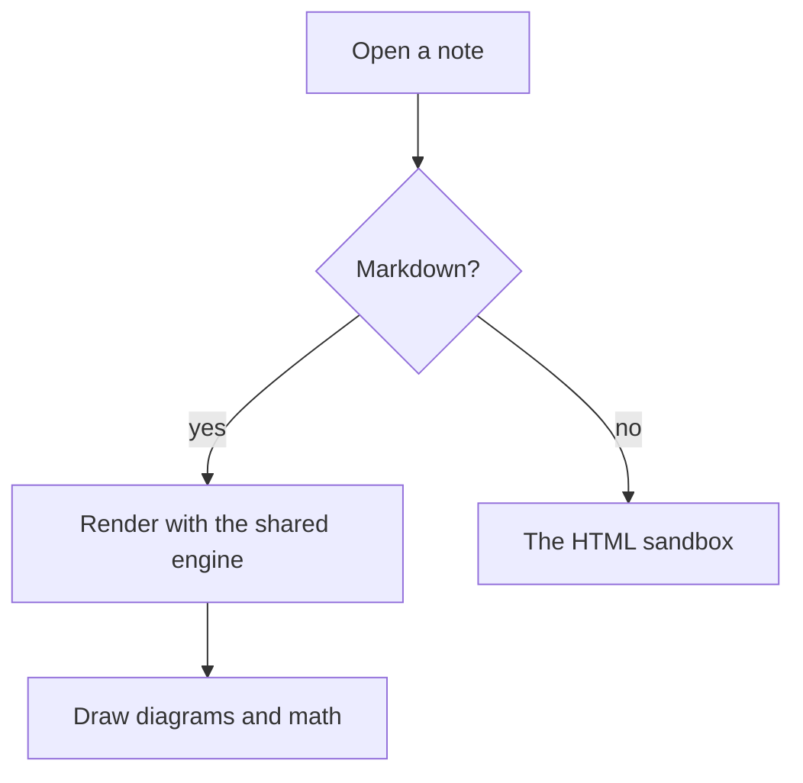

# The reader's fixture note: every construct Phase 12j's acceptance names.
# A callout of every kind, a mermaid flowchart, inline and display math,
# a table, a task list, wikilinks (resolved and dashed), tags, an image,
# code with syntax highlighting, and the injection attempts the sandbox
# test proves cannot run. Written to match the web's reading mode at
# 390px; the same body backs the parity screenshots.

# Headings, lists, and text

Welcome to the fixture. This paragraph has **bold**, *italic*, `code`,
a [link](https://example.com/), and a footnote.[^1]

- A plain list item
- Another, with a nested list
  - Nested deeper
- And back

1. Numbers work too
2. Second

## Wikilinks and tags

A resolved link to [[Fixture target]] and an alias to [[Fixture target|the same note, named differently]].
A dashed one: [[A note that does not exist]].

Tags inline: #project/fixture #testing and #done.

# Tasks

- [ ] An open task
- [x] A done task
- [ ] Another open one, with a [[wikilink|link]] inside

# Callouts of every kind

> [!note] Note
> The plain note callout.

> [!info] Info
> Something informational.

> [!tip] Tip
> A better way to do it.

> [!question] Question
> What about this?

> [!warning] Warning
> Careful here.

> [!danger] Danger
> This destroys data.

> [!custom] Any other kind
> Renders as a plain callout titled with the kind.

> [!note]- Folded
> This one starts folded; tapping the title opens it.

# Mermaid



# Math

Inline math $E = mc^2$ sits in a sentence, and display math below:

$$\int_0^1 x^2 \, dx = \frac{1}{3}$$

# Tables

| Construct | Renders | Taps |
|---|---|---|
| Wikilink | resolved or dashed | opens or creates |
| Tag | chip | opens search |
| Task | checkbox | ticks |

# Images and code


```go
func main() {
    fmt.Println("chroma highlights this")
}
```

```
Plain fence, no language
```

> A plain blockquote, not a callout.

---

[^1]: The footnote at the end.

<div>
<script>alert('never runs')</script>

<a href="javascript:alert('never runs')">a javascript: link</a>
</div>
