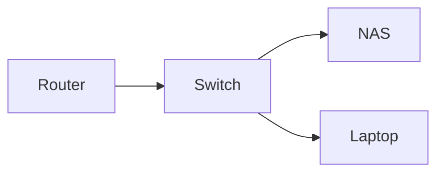

# Start here

This is a note. It is a plain file on the server, `Start here.md`, and you can open it in any text editor and see exactly this. Everything the app does, it does with files like this one.

Read this note once, then delete it or keep it. If you ever want it back, open Help (in the account menu, or the command palette) and pick "Open the guide". #guide

## Writing

A note is markdown. Type text and it is a paragraph. A line starting with `#` is a heading, `##` a smaller one. `**bold**` is **bold**, `_italic_` is _italic_, and a backtick pair makes `code`.

- A line starting with `-` is a list item
- Another one

1. Numbers make a numbered list
2. Like this

On a desktop, press **E** to edit and **Esc** to go back to reading, or use Read, Edit and Split in the bar above the note. The buttons in that bar insert the marks for you. On a phone, tap **Edit**; a bar of buttons sits above the keyboard.

## Links between notes

Write the name of a note inside double square brackets and it becomes a link. This one goes to a note that exists: [[A linked note]]. This one goes to a note that does not exist yet: [[A note that does not exist yet]]. Click it and the note is created for you at that path.

To show different text, put a bar after the name: [[A linked note|a friendlier label]].

How to make one:

- **Desktop:** click the Link button in the bar above the editor, or type `[[` and start typing a name. A list of your notes appears; pick one and the link is finished for you. You can also drag a note out of the sidebar into the editor.
- **Phone:** tap Link on the bar above the keyboard, or type `[[` and pick from the list.

Every note that links here is listed under **Backlinks** in Details (the panel button in the bar above the note). Rename or move a note and every link to it is rewritten.

## Pictures and files

An image sits in an `_assets` folder beside the note and is shown with a line like ``:


How to add one:

- **Desktop:** drag a file onto the editor, paste one from the clipboard, or click the Attach button in the bar above the editor. The file is uploaded and the line is written for you.
- **Phone:** tap Attach on the bar above the keyboard; it opens the photo picker, the camera, or the file browser.

A picture becomes an inline image. Anything else — a PDF, a spreadsheet, a document — becomes a plain link and a card in the rendered note: its name, its size, and for a PDF its page count, with a button to open it and a link to download it. A PDF opens inline in a sandboxed viewer; other files open in the system viewer or download. The text inside a PDF is searched along with your notes, so a phrase from page forty of a manual finds the manual.

## Tasks

A list item that starts with `[ ]` is a task. In reading mode, tick the box and the file is updated. Try it:

- [ ] Tick this one
- [x] This one is done
- [ ] Add a task of your own with the Task button

Every open box also gathers on the **Tasks** page: the sidebar, the bottom bar on a phone, the palette, or the keyboard shortcut in Help. It lists them by the note they live in across a whole space (or all of them), each row links back to its line in the note, and ticking there ticks the note. Filters narrow it to a folder or a tag, and a toggle shows what was completed in the last thirty days.

## Tags

A word with `#` in front of it is a tag: #guide, for example. Tags are clickable in the rendered note and in the title area. A tag's page lists every note carrying it, and the note switcher finds notes by tag when you type `#`. Tags are not folders; a note can carry as many as you like.

## Today and capture

**Today** opens today's daily note and creates it if it is not there yet. **Capture** takes one line and appends it to today's note without opening it, which is the fastest way to write something down on a phone. Both are on the home screen, in the bottom bar on a phone, and in the command palette.

## Finding things

- The **search** box in the sidebar searches titles and bodies. On a phone, the search page has its own tab in the bottom bar.
- Search takes operators. Put one in front of a word: `tag:home` (or `#home`), `path:folder/`, `space:work`, `is:untagged`, `is:task` (an open task), `is:html`, `has:image`, `has:attachment`, `author:claude` (the last edit), `before:2026-01-01`, `after:2026-01-01`. A `-` in front excludes (`-tag:done`), and quotes make an exact phrase (`"water heater"`). They combine: `tag:home -tag:done "water heater" after:2026-01-01`. Anything else is searched as text. The box suggests tags and folders as you type an operator, and a query worth keeping is saved under a name and pinned under the box.
- **Open a note** (the switcher) jumps to a note by name or tag; it lists what you opened recently first, and `tag:` and `path:` work in it too.
- The **command palette** lists everything the app can do. Open it with the keyboard shortcut shown in Help, or from the menu.
- Recently opened and pinned notes sit on the home screen. Pin a note from its menu to keep it at the top of the sidebar.

## Folders and moving

Folders are real folders on disk. Make one with the plus beside a space name in the sidebar, or with New folder in the palette. Drag a note onto a folder to move it; on a phone, use **Move to a folder** in the note's menu. The links pointing at a moved note are rewritten for you.

## History

Every change is kept. Details shows the note's history; pick a version to see what changed and restore it if you want. Deleted notes go to the trash and can be brought back for thirty days.

## Sharing a space

The top-level folders are spaces. Each space has members with a role: an owner, editors, and viewers. Add someone under Settings → People, then give them a role under Settings → Spaces. They sign in and see the spaces they belong to, and nothing else.

## Agents

An agent can read and write notes the same way you do, through the files, or from another machine through MCP. Settings → Agents makes a key for one. Every write an agent makes is shown live, saved to the file, and attributed to that agent in the history. The details are in the documentation under `docs/agents.md`.

## Diagrams, callouts and math

A code block whose language is `mermaid` is drawn as a diagram:



A quote that starts with `[!tip]`, `[!note]`, `[!warning]`, `[!danger]`, `[!info]` or `[!question]` is a callout. Text after the kind is its title.

> [!tip] Callouts hold markdown
> Lists, links and `code` all work inside. Put a `-` after the kind, as in `[!note]-`, and the callout folds.

Math goes between dollar signs: $E = mc^2$ inline, or on lines of its own between `$$` marks. A dollar sign with a space after it, as in $5 and $10, stays a dollar sign.

## Code, tables and footnotes

```sh
yana --help
```

| What | Where |
|---|---|
| Notes | `.md` files in the tree |
| Pictures and files | `_assets/` beside the note |
| The index | `.sync/`, safe to delete |

A footnote looks like this.[^1]

[^1]: And lands at the bottom of the note.

## Keyboard

Every shortcut is listed under Help, in the account menu and the command palette. The ones worth learning first: **E** to edit, **Esc** to read, and the palette shortcut.
